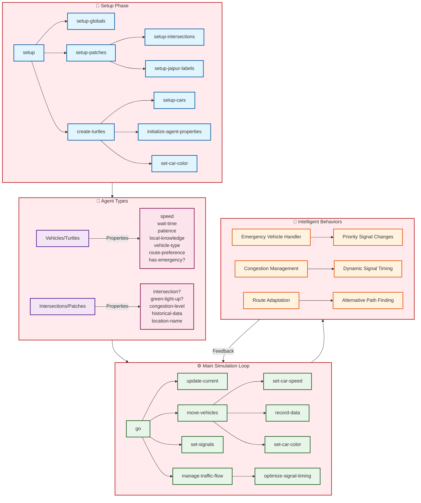

# Multi-Agent Traffic Simulation for Jaipur using NetLogo

## Overview

This project simulates Jaipur's traffic system using a multi-agent approach, implemented in **NetLogo**, a platform for agent-based modeling. The simulation models real-world traffic dynamics by simulating various agents, their interactions, and environmental factors. It aims to provide insights into traffic behavior, identify bottlenecks, and explore strategies to optimize traffic flow.

---

https://github.com/user-attachments/assets/21adfb13-0a7a-4d41-81de-473d45069aec

---

## Features

1. **Agent Types**

   - **Vehicle Agents (Turtles)**: Represent vehicles like cars, two-wheelers, buses, and auto-rickshaws.
   - **Intersection Agents (Patches)**: Represent traffic signals and road intersections, with location-specific configurations for Jaipur.

2. **Agent Interactions**

   - **Vehicle-to-Vehicle**: Interactions for speed adjustments, lane management, and emergency vehicle responses.
   - **Vehicle-to-Intersection**: Decisions influenced by traffic signals, congestion levels, and route preferences.
   - **Intersection-to-Intersection**: Signal coordination and congestion data sharing.

3. **Intelligent Behaviors**

   - Dynamic traffic signal adjustments.
   - Emergency vehicle prioritization.
   - Adaptive learning for optimal traffic flow.

4. **Emergent Behavior**
   - Congestion patterns emerge naturally.
   - Traffic flow self-organizes based on local conditions.

---

## Simulation Flow

### 1. **Setup Phase**

- Initialize the Jaipur road network.
- Generate vehicle agents with unique properties:
  - Speed, patience, and route preferences.
  - Emergency vehicles with special privileges.
- Configure intersection agents:
  - Jaipur-specific location names.
  - Initial signal states and congestion levels.

### 2. **Runtime Phase**

- Continuous updates to agent states at every tick.
- Vehicle agents make decisions based on:
  - Local conditions (e.g., congestion, signal states).
  - Interactions with nearby agents.
- Intersection agents adapt dynamically:
  - Adjust signal timing based on congestion.
  - Share information with neighboring intersections.

---



## Types of Agents

### **1. Vehicle Agents (Turtles)**

- **Properties**:
  - **Speed**: Varies by vehicle type (e.g., two-wheelers are faster than buses in light traffic).
  - **Patience**: Influences route-changing behavior during congestion.
  - **Route Preferences**: Based on distance, congestion, and familiarity.
- **Behaviors**:
  - Adjust speed dynamically.
  - Respond to congestion and signals.
  - Emergency vehicles can bypass signals or influence traffic flow.

### **2. Intersection Agents (Patches)**

- **Properties**:
  - Signal states (green, yellow, red).
  - Congestion levels.
  - Historical traffic data.
- **Behaviors**:
  - Dynamic signal timing adjustments.
  - Emergency vehicle prioritization.
  - Coordination with neighboring intersections.

---

## Agent Interactions

### **1. Vehicle-to-Vehicle**

- Detect vehicles ahead and adjust speed.
- Influence of emergency vehicles on surrounding traffic.
- Different vehicle types exhibit unique behaviors (e.g., buses accelerate slower).

### **2. Vehicle-to-Intersection**

- Vehicles decide whether to stop or proceed based on signals.
- Alternate routes selected during high congestion.
- Emergency vehicles trigger signal changes.

### **3. Intersection-to-Intersection**

- Exchange congestion information.
- Coordinate signal timings to reduce bottlenecks.

---

## Intelligent Behaviors

### **1. Vehicle Intelligence**

- Patience-based decisions for rerouting.
- Dynamic speed adjustment based on vehicle type.
- Utilize local knowledge of road network.

### **2. Intersection Intelligence**

- Monitor and adapt to real-time congestion levels.
- Collect and utilize historical traffic data.
- Prioritize emergency vehicles dynamically.

---

## Simulation Cycle

### **1. Setup Phase**

- Define the road network layout.
- Spawn agents with Jaipur-specific attributes.
- Initialize traffic signals and congestion data.

### **2. Runtime Phase**

- Update agent states continuously.
- Monitor traffic patterns and adapt dynamically.
- Collect data for analysis and optimization.

---

## Emergent Behavior

- **Congestion Formation**: Naturally forms at bottlenecks.
- **System Adaptation**: Responds to emergencies and evolving conditions.
- **Self-Organizing Traffic Flow**: Local rules lead to global order.

---

## Key Features of Multi-Agent Simulation

1. **Decentralized Control**

   - No central authority governs traffic.
   - Autonomous agents interact to determine system behavior.

2. **Adaptive Learning**

   - Agents adapt based on historical and real-time data.
   - Routes, signal timings, and behaviors evolve over time.

3. **Environmental Interaction**
   - Agents respond to road layouts and signal patterns.
   - Congestion levels directly influence decision-making.

---

## Tools and Technologies

- **NetLogo**: For agent-based simulation and visualization.
- **Traffic Data**: Jaipur-specific data for realistic modeling.

---

## How to Run the Simulation

1. Clone the repository:
   ```bash
   git clone <repository_url>
   ```
2. Open the `.nlogo` file in **NetLogo**.
3. Run the **Setup** button to initialize the simulation.
4. Use the **Go** button to start the simulation.

---

## Future Work

1. Extend the road network for larger-scale simulation.
2. Integrate real-world traffic data for more accuracy.
3. Add features like pedestrian agents and public transportation systems.

---

## License

This project is licensed under the MIT License. See the `LICENSE` file for details.
